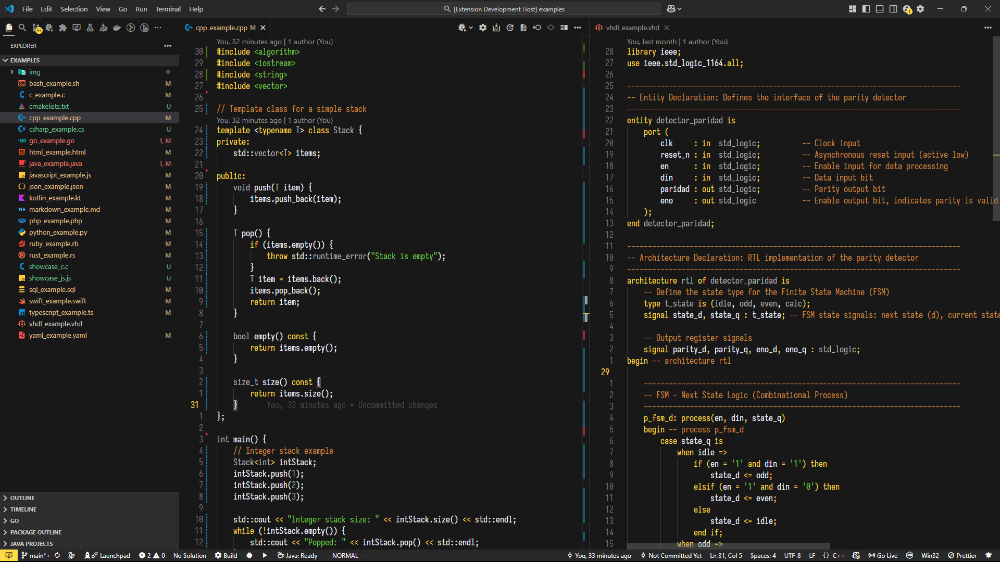
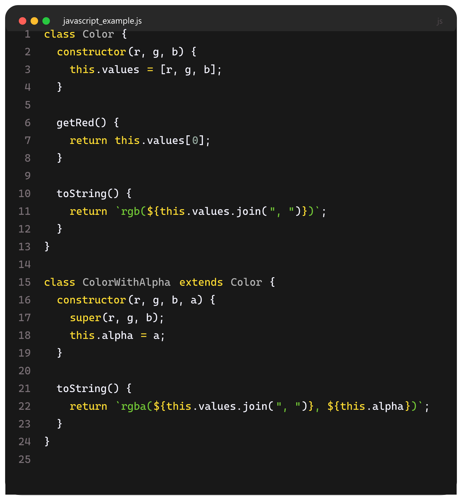
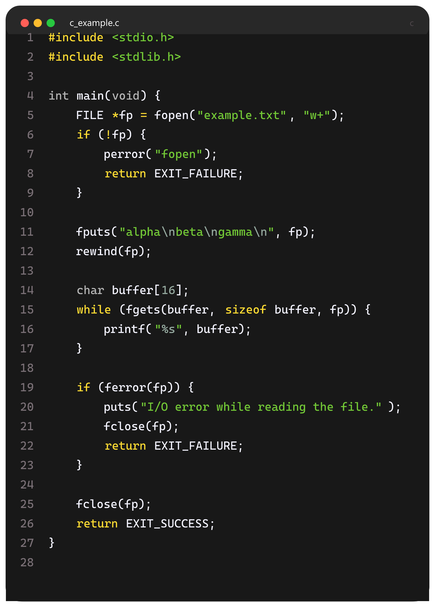

# Gruber Darker VS Code Theme

A VS Code port of the classic Gruber Darker look, based on JoaoAJMatos's adaptation and tuned for readability and high-contrast.

## Preview



| JavaScript | C |
| --- | --- |
|  |  |

Additional language previews are available in [`img/`](img).

## Installation

1. Open Visual Studio Code.
2. Open Extensions with `Ctrl+Shift+X`.
3. Search for `Gruber Darker Theme`.
4. Install the extension.
5. Run `Preferences: Color Theme` and pick `Tsoding Gruber Darker`.

## Recommended Settings

These settings match the screenshots and fit the theme best:

```json
{
  "editor.bracketPairColorization.enabled": false,
  "editor.renderLineHighlight": "none",
  "workbench.activityBar.location": "top"
}
```

If you use [VSCodeVim](https://marketplace.visualstudio.com/items?itemName=vscodevim.vim), these overrides keep search and yank highlights readable:

```json
{
  "vim.highlightedyank.color": "rgba(255, 255, 255, 0.1)",
  "vim.searchMatchTextColor": "#0a0a0a",
  "vim.searchHighlightTextColor": "#0a0a0a"
}
```

## Development

```bash
npm install
npm run build
npm run generate:assets
npm run package
```

Publishing commands:

- `npm run publish:vscode`
- `npm run publish:ovsx`

## Credits

-   **John Gruber**
    Original designer of the Gruber Dark theme for BBEdit.
    [Visit Daring Fireball](https://daringfireball.net/projects/bbcolors/schemes/)

-   **Jason Blevins**
    Developed the original Emacs version of Gruber Darker.
    [Visit Jason Blevins](https://jblevins.org/projects/emacs-color-themes/)

-   **Alexey Kutepov (rexim)**
    Adapted and extended the Emacs theme for modern use.
    [View gruber-darker-theme on GitHub](https://github.com/rexim/gruber-darker-theme)

-   **JoaoAJMatos**
    Provided the adaptation that inspired this VSCode port.
    [Tsoding-Color-Theme on the GitHub](https://github.com/JoaoAJMatos/Tsoding-Color-Theme)

## License

Licensed under the [MIT License](LICENSE).
