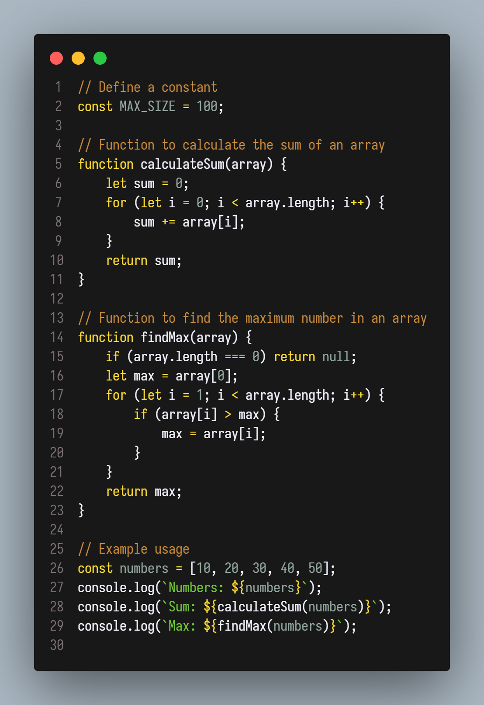

# Gruber Darker VSCode Theme

A port of the classic Gruber Darker Emacs theme, based on JoaoAJMatos's adaptation. This theme delivers a refined dark palette optimized for readability in Visual Studio Code.

## Features

- **Faithful Adaptation:** Inspired by the original Gruber Darker theme for Emacs.
- **Optimized Readability:** Dark, subtle colors that reduce eye strain.
- **Wide Language Support:** Works with multiple programming languages.

## Installation

1. Open Visual Studio Code.
2. Go to the Extensions view (`Ctrl+Shift+X`).
3. Search for **Gruber Darker Theme**.
4. Click **Install**.
5. Open the Command Palette (`Ctrl+Shift+P`), type **Color Theme**, and select **Gruber Darker Theme**.

## Code Screenshots

<div style="display: flex; justify-content: space-between;">
    
    
</div>

## Editor Screenshot


## Usage

To set the theme:

1. Open the Command Palette (`Ctrl+Shift+P`).
2. Choose **Preferences: Color Theme**.
3. Select **Gruber Darker Theme** from the list.

## Configuration

Customize theme settings in your `settings.json`. For example:

```json
{
  "workbench.colorTheme": "Gruber Darker Theme",
  "editor.tokenColorCustomizations": {
    "textMateRules": [
      {
        "scope": "entity.name.function.preprocessor.cpp",
        "settings": {
          "foreground": "#FF5733",
          "fontStyle": "bold"
        }
      }
    ]
  }
}
```

## Contributing

Contributions are welcome! To contribute:

- Fork the repository.
- Create a new branch for your feature or fix.
- Submit a pull request with your changes.

## Credits

- **John Gruber**  
  Original designer of the Gruber Dark theme for BBEdit.  
  [Visit Daring Fireball](https://daringfireball.net/projects/bbcolors/schemes/)

- **Jason Blevins**  
  Developed the original Emacs version of Gruber Darker.  
  [Visit Jason Blevins](https://jblevins.org/projects/emacs-color-themes/)

- **Alexey Kutepov (rexim)**  
  Adapted and extended the Emacs theme for modern use.  
  [View gruber-darker-theme on GitHub](https://github.com/rexim/gruber-darker-theme)

- **JoaoAJMatos**  
  Provided the adaptation that inspired this VSCode port.  
  [Tsoding-Color-Theme on the GitHub](https://github.com/JoaoAJMatos/Tsoding-Color-Theme)

## License

This project is licensed under the [MIT License](LICENSE).
